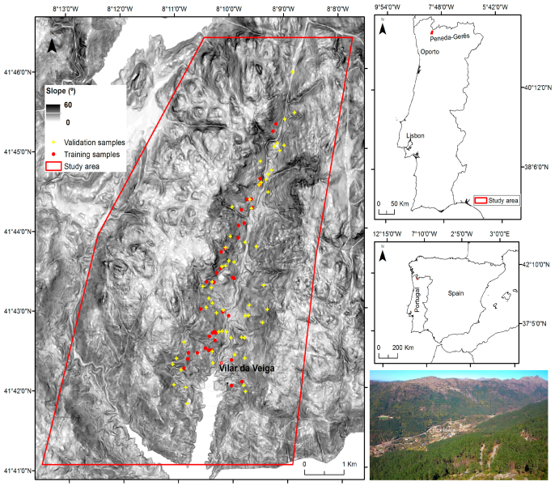
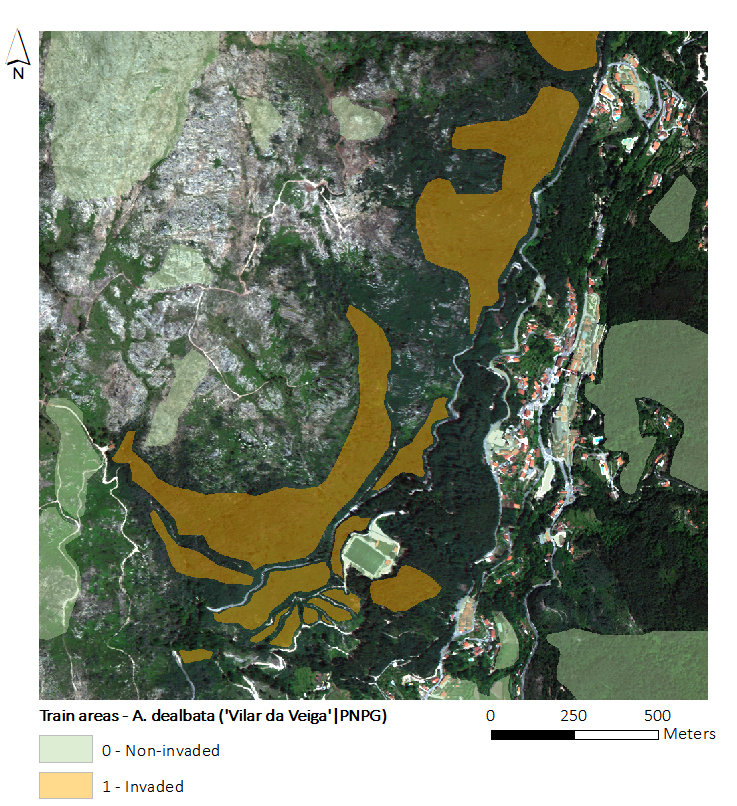
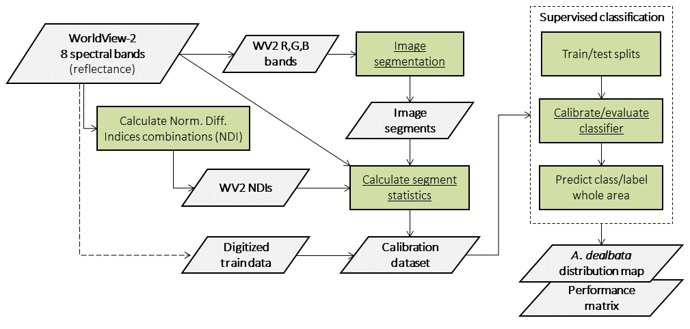
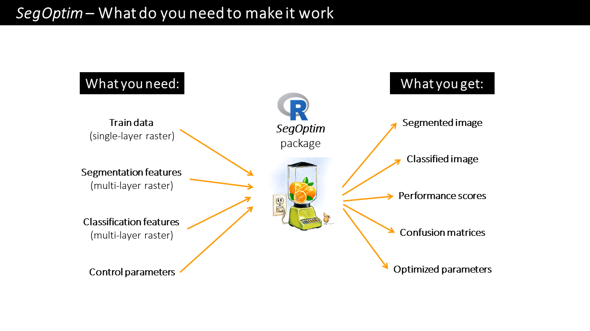

# Introduction 

--------------------------------------------------------------------------------------

In this exercise we are going to map areas invaded by _Acacia dealbata_ in __Vilar da Veiga__, 
a mountainous area located in Peneda-Gerês National Park, NW Portugal. Total precipitation 
in the are amounts to 1300 mm/year and mean annual temperature to 13 C, with large amplitude in mean 
annual values between cold and warm seasons (-10 to 35 C). Elevation ranges from 145 to 1253m 
with steep slopes.                  
                
          
      

            
                   

        
               
# Methods

--------------------------------------------------------------------------------------

To map the actual distribution of _A. dealbata_, we will use one WorldView-2 (WV2) image (with 
eight spectral bands) and training data (i.e., hand-digitized patches delineated using the WV2 
image and after field visits to the site). These data contains both invaded and non-invaded 
patches. 

The figure below presents a RGB composite of the WV2 image with training areas overlapped.



## Input image data 

The Worldview-2 (WV2) image tat we are going to use was collected during summer (23 June 2013). 
WV2 platform records data in eight spectral bands with a ground resolution of 2 m:

- [B1] Coastal blue (400 - 450nm), 
- [B2] Blue (450 - 510nm), 
- [B3] Green (510 - 580nm), 
- [B4] Yellow (590 - 630nm), 
- [B5] Red (630 - 690nm), 
- [B6] Red edge (710 - 750nm), 
- [B7] Near-Infrared 1 (770 - 900nm), and 
- [B8] Near Infrared 2 (860 - 1040nm). 

Imagery pre-processing consisted in the orthorectification of the scene using a Digital 
Elevation Model (DEM; 20 m spatial resolution) and a bilinear convolution algorithm based 
on six ground control points, yielding average Root Mean Square Error values (RMSE) of 1.45 m. 
Surface reflectance was obtained by further processing the data with atmospheric correction.


## Object-based Image Analysis (OBIA) 

An Object-based Image Analysis (OBIA) approach will be employed in this exercise. The workflow 
is presented in the figure below. 





To map the target species we will use _SegOptim_ - a R package developed in ECOCHANGE team  
used to perform object-based analyses of EO data. _SegOptim_ allows to interface multiple 
GIS/RS analysis software, such as Orfeo Toolbox (OTB), GRASS, SAGA, etc. and use them to 
perform image segmentation. 

Using the segmented image, we can then run supervised classification, which allows combining 
field or digitized training data with spectral image features to obtain maps with the actual 
distribution of target species. 


_SegOptim_ uses three main input layers described in the figure below.





A bried description of _SegOptim_ package inputs:


- __Training data__: typically a single-layer raster dataset containing samples for 
training a classifier.


- __Segmentation features__: typically a multi-layer raster dataset with features used only 
for the segmentation stage (e.g., spectral bands, spectral indices, texture). This data will 
be used by the segmentation algorithm to group similar neighboring pixels into objects 
(or 'super-pixels').


- __Classification features__: also a multi-layer raster dataset with features used 
for classification (e.g., spectral bands and indices, texture, elevation, slope). 
This will allow the classification algorithm to extract/learn the spectral profile and 
get the classification rules.

Use R help system to get more info on _SegOptim_ functions.


# Now, let's code!

--------------------------------------------------------------------------------------


## Inputs

--------------------------------------------------------------------------------------

First, define the correct working directory according to your own settings (change what is inside the ""): 

```{r Set work dir, message=FALSE, warning=FALSE}

setwd("D:/MyDocs/R-dev/ECOCHANGE/AdvancedCourse_ModsInvasionEco2019/Day1_RemoteSensing_UAVs")

```

Now load the libraries and define the data inputs:

```{r Set raster inputs and load packages, message=FALSE, warning=FALSE}

library(raster)
library(randomForest)
library(SegOptim)

# Path to raster data used for image segmentation
# In SEGM_FEAT directory
inputSegFeat.path <- "./SEGM_FEAT/WV2_b532_VilarVeiga_smallTestSite.tif"

# Path to training raster data
# [0] Non-invaded areas [1] Acacia dealbata invaded areas
# In TRAIN_AREAS directory
trainData.path <- "./TRAIN_AREAS/trainAreas_Adealbata_VVeiga_WV2_v1.tif"

# Path to raster data used as classification features
# In CLASSIF_FEAT directory
classificationFeatures.path <- 
  c("./CLASSIF_FEAT/WV2_NDIcombns_VilarVeiga_smallTestSite.tif",
    "./CLASSIF_FEAT/WV2_VilarVeiga_smallTestSite.tif")

# Path to Orfeo Toolbox binaries 
otbPath <- "C:/OTB/bin"

```


## Outputs

--------------------------------------------------------------------------------------

Now, let´s define the ouput files generated by the analyses:

```{r Set raster outputs}    

## Output file from OTB image segmentation     
outSegmRst.path <- "segmRaster.tif"

# The final output file containing the distribution of the target species
outClassRst.path <- "WV2_VilarVeiga_AcaciaSpp.tif"

```


## Run OTB image segmentation

--------------------------------------------------------------------------------------

This section will use _SegOptim_ interface functions to run OTB's Large Scale Mean Shift (LSMS) 
image segmentation algorithm. Segmentation involves the partitioning of an image into a set of 
jointly exhaustive and mutually disjoint regions (a.k.a. segments, composed by multiple image 
pixels), that are internally more homogeneous and similar, compared to adjacent ones. Image segments 
are then related to geographic objects of interest (e.g., forests, agricultural or urban areas) 
through some form of object-based classification (the following step in this exercise).
            
```{r Run image segmentation, message=FALSE, warning=FALSE}

## To know more about the algorithm and its parameters use the help
?segmentation_OTB_LSMS
    
## Run the segmentation
outSegmRst <- segmentation_OTB_LSMS(
                      # Input raster with features/bands to segment
                      inputRstPath = inputSegFeat.path, 
                      # Algorithm params
                      SpectralRange = 3.1, 
                      SpatialRange = 4.5, 
                      MinSize = 21,
                      # Output
                      outputSegmRst = outSegmRst.path,
                      verbose = TRUE,
                      otbBinPath = otbPath,
                      lsms_maxiter = 50)

# Check the file paths with outputs
print(outSegmRst)

# Load the segmented raster and plot it
segmRst <- raster(outSegmRst$segm)

plot(segmRst)

```


You can use a GIS software to better inspect and visualize the output segmented raster. 
Notice that each segment is indexed by an integer number.

             
## Load train data and classification features

--------------------------------------------------------------------------------------

This code chunk is used to load train data and classification features. Train data for 
_SegOptim_ is simply a raster file with digitized training cases. These are later imported 
into image segments as we will see. In our case, the file contains areas invaded by _A. dealbata_ 
(1's) and non-invaded (0's).      

As for classification features, the files contain:     

- Surface reflectance for the eight WV2 bands;
- All combinations (without order) of __Normalized Difference Indices__ (NDI; 28 in total), 
calculated as:     

$$NDI = \frac{(b_i - b_j)}{(b_i + b_j)}$$

Where $b_i$ and $b_j$ are any two different spectral bands. In total we will use 36 features 
(or variables) for supervised classification. Run the following code chunk to load the data using 
_raster_ package functionalities.


```{r Load data}

# Train data
trainDataRst <- raster(trainData.path)

# Classification features
classificationFeatures <- stack(classificationFeatures.path) 
# Change the names for each layer
names(classificationFeatures) <- c(paste("NDI_",1:28,sep=""),paste("SpecBand_",1:8,sep=""))

```


## Prepare the calibration dataset 

--------------------------------------------------------------------------------------

In this step we will assemble the training data required to the supervised classification. 
This will import training data into each image segment (via a threshold rule). In this case, 
segments that are covered in 50% or more by the training pixels will be considered as valid cases 
either for 0's (non-invaded) or 1's (invaded).     

We will also use this functions to calculate some statistics from the classification features 
raster. This will aggregate pixel values in each segment through the average function (other 
aggregation measures can be used; e.g. std.-dev., median, quantiles, skewness, kurtosis).

Using this function will produce an object of class _SOptim.CalData_ containing two elements:

1. __calData__ - A data frame object containing calibration data for training and evaluating a classifier 
algorithm. The first column (named "SID") contains the ID of each segment, and the second column 
(named "train") holds the segment class (or label). The following n columns hold the classification 
features for training;          

2. __classifFeatData__ - A data frame containing all segments and features from inputs. The first column 
(named "SID") holds the unique identifier for each image segment. The following n columns are used 
as classification features. Typically this dataset is used for predicting the target class after 
calibrating a certain classifier algorithm.       

Run the following code chunk to generate the calibration dataset.     
      

```{r Prepare cal data}

# Check help for details
?prepareCalData 
                          

calData <- prepareCalData(rstSegm = segmRst, 
                          trainData = trainDataRst, 
                          rstFeatures = classificationFeatures, 
                          thresh = 0.5, 
                          funs = "mean", 
                          minImgSegm = 30, 
                          verbose = TRUE)

```


## Calibrate/evaluate the supervised classifier

--------------------------------------------------------------------------------------

We will use the training data in combination with satellite data (NDIs and original 
spectral bands) to map the distribution of _A. dealbata_. 

The Random Forest (RF) algorithm will be used for this purpose. RF are an ensemble learning method for 
classification, regression and other tasks, that operate by constructing multiple decision 
trees during the training stage and outputting the class that is the mode of the classes 
(classification) or the average prediction (regression) of the individual trees. This way, RF 
correct for decision trees' habit of over-fitting to their training set.

For evaluation purposes, we will employ 10 fold cross-validation (i.e., ten splits with 
90% train / 10% test). 

Cohen's _Kappa_ was selected as the evaluation metric (although others can be calculated later). 

A minimum of 30 total train cases were set, and in each train/test 
split we set 10 for training and 5 for testing as the minimum. Notice that the _runFullCalibration_ 
option must always be set to _TRUE_ (check help for more details).      
  

```{r Calibrate Random Forest classifier}

# Check the function help
?calibrateClassifier

# Calibrate/evaluate the RF classifier
classifObj <- calibrateClassifier( calData                    = calData,
                                   classificationMethod       = "RF",
                                   balanceTrainData           = FALSE,
                                   balanceMethod              = "ubOver",
                                   evalMethod                 = "10FCV",
                                   evalMetric                 = "Kappa",
                                   minTrainCases              = 30,
                                   minCasesByClassTrain       = 10,
                                   minCasesByClassTest        = 5,
                                   runFullCalibration         = TRUE)

# Get more evaluation measures
evalMatrix <- evalPerformanceClassifier(classifObj)

print(round(evalMatrix,2))


```


Finally, predict the class label for the entire image (i.e., outside the training set) 
and also save the classified image:

```{r Predict segments}

rstPredSegmRF <- predictSegments(classifierObj = classifObj, 
                                 calData = calData, 
                                 rstSegm = segmRst, 
                                 predictFor = "all", 
                                 filename = outClassRst.path)
print(rstPredSegmRF)

plot(rstPredSegmRF)

```


As before, you can use a GIS software to better inspect and visualize the output classified raster. 

You can further inspect other elements in the _classifObj_ object, such as the most important features 
for the RF classifier. Play the code below.


```{r RF Variable importance, fig.height=6}

# Variable importance 
varImpPlot(classifObj$ClassObj$FULL)


```


