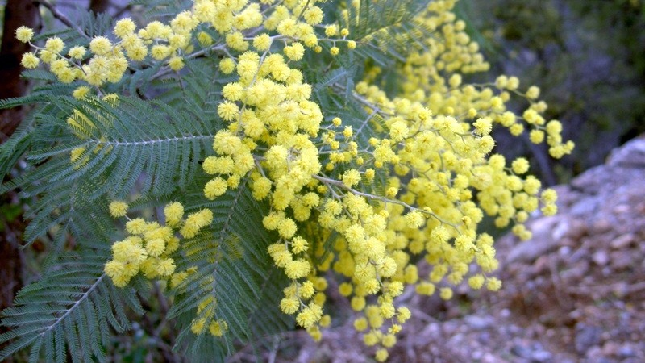

# Advanced Course | CIBIO-InBIO

## Models in Invasion Ecology: Challenges and Applications

18th - 20th March 2019, Vairão, V. Conde

Repository of the Models in Invasion Ecology Advanced Course 2019

---------------------------------------------------------------------

### Folders by session

- **Day1_RemoteSensing_UAVs** - Satellites and Unmanned Aerial Vehicles (UAVs) for detecting and modelling invasive species (João Gonçalves & Renato Henriques)
  
- **Day2_SDM** - Species Distribution / Habitat Suitability Models session (Joana Vicente)

- **Day2_MultivariateAnalysis** - Multivariate Analysis session (Ana Sofia Vaz)

- **Day3_StDM** - Stochastic Dynamic Models session (João Cabral, Mário Santos & Rita Bastos)